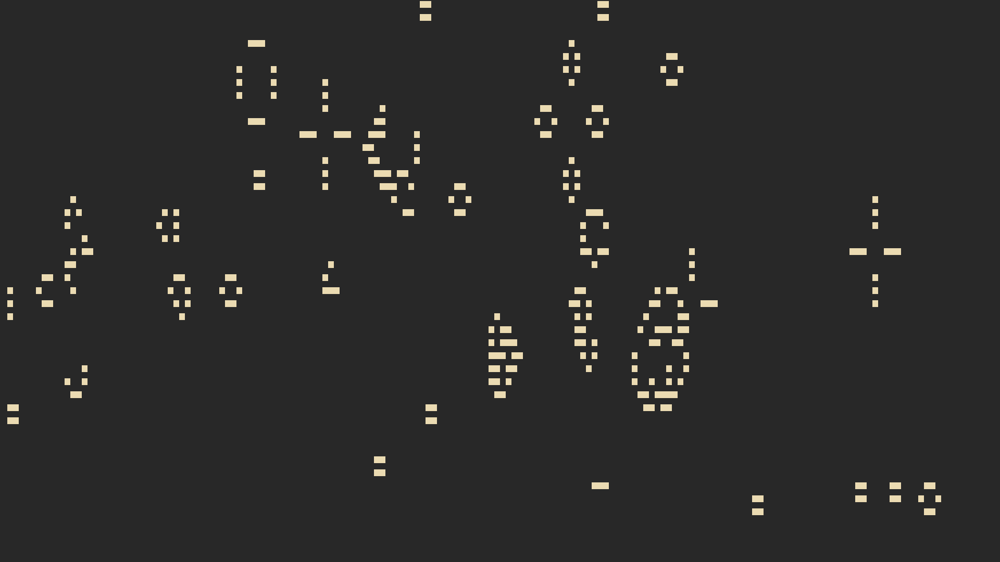

## conway-ncurses
An Ncurses implementation of [Conway's Game of Life](https://en.wikipedia.org/wiki/Conway's_Game_of_Life)

## Building
- ncurses and cursesw is required to build and run the program
- To Build And Run
```
$ make
```
- if you want you can remove the debug flags from the makeFile(-ggdb3, -O0) that will make the program blazingly fast(although its already blazingly fast)

## current progress
_this program is currently at the building stage, its good enough to generate random state of life and change it according to the game rules_
