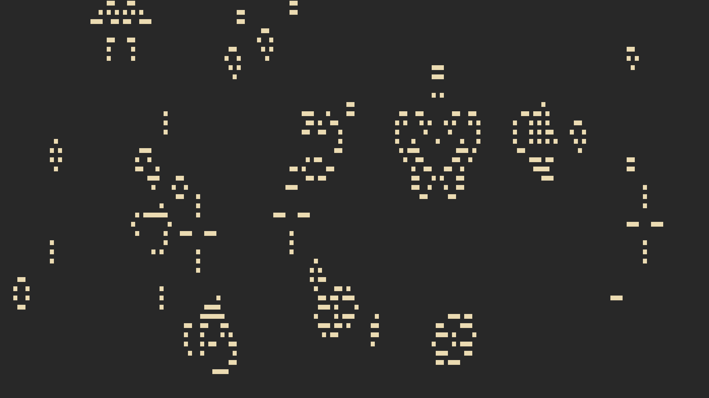

## conway-ncurses
An Ncurses implementation of [Conway's Game of Life](https://en.wikipedia.org/wiki/Conway's_Game_of_Life)

## Building
- ncurses and cursesw is required to build and run the program
- To Build 
```
$ make
```
then you will find the executable in the bin folder

# game Controls
* `return or enter`, `s` - play/pause the game
* `-` - decrease speed of the game
* `+` - increase speed of the game
* `n` - skip to the next generation
* `q` - quit
